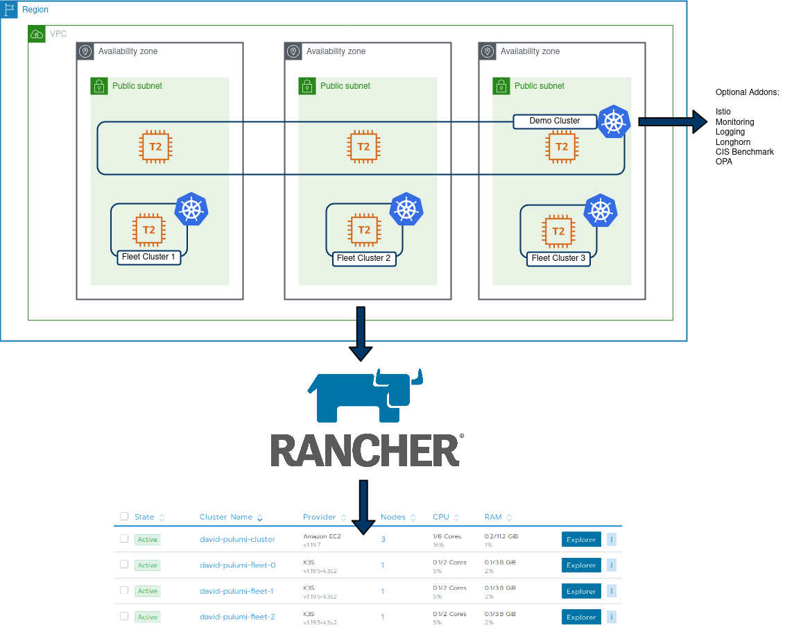

# Rancher-Pulumi-Demo

Repo for generating Rancher Kubernetes cluster environments on AWS. Includes the creation of:

* AWS VPC
* AWS Subnets
* AWS Gateway
* AWS Security Group
* AWS Default Route Table
* Rancher Cloud Credentials
* Rancher Node Templates
* Rancher Demo cluster (3x nodes, RKE)
* Rancher Fleet clusters (3 clusters, each with 1 node, based on k3s)

# Instructions

* Clone repo
* Rename `Pulumi.dev.yaml.example` to `Pulumi.dev.yaml`
* run `pulumi config set rancherEC2SecretKey --secret` followed by your AWS secret key (required for Rancher cloud credentials)
* Run `pulumi config set rancherEC2AccessKey --secret` followed by your AWS access key (required for Rancher cloud credentials)
* Create AWS auth settings - https://www.pulumi.com/docs/intro/cloud-providers/aws/setup/
* Create Rancher2 auth settings - https://www.pulumi.com/docs/intro/cloud-providers/rancher2/
* Run `pulumi preview` to see what will be created
* Run `pulumi up` to initiate the resource creation
